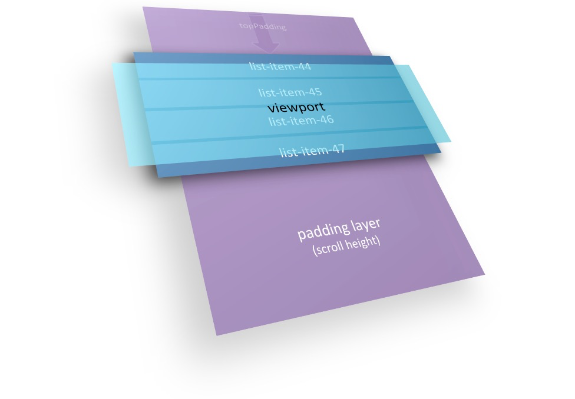

# Design for virtual scrolling for tree view

## Motivation

To run with great performance, that's very common that virtual scrolling technology is used for long data list in a large amount of mobile applications.

Here is a demonstration picture showing the concepts of virtual scrolling. [Borrow from rintoj's blog](https://medium.com/@rintoj/building-virtual-scroll-for-angular-2-7679ca95014e).

However, virtual scrolling is relatively easy to implement for list view. **It has only one level of list**.

For tree view(nested list), it has potential to hold much more levels of lists. That could be nightmare to maintain the scroll consistency between levels.

## Failed Attempt

I had tried to figure out some equations to calculate out those data items ought to be display in the viewport. Because I don't want to iterate over all data items of the tree. It will have low performance with very large list, like > 10,000 items, when frequent triggering with scroll events is potential.

Apparently, I failed to do so, at lease for now. The main reason is:

> Combining with the various state of the tree node(like expand, collapse, hidden, ...), you can't just use some equations to calculate out the targets without iteration over the tree for retrieving information.

## A way out

Then we have to try a little dirty way.

That's what [angular-tree-component](https://github.com/500tech/angular-tree-component) is doing now. I didn't want to try it before is somehow because of the reason why I create this repo(That's another topic). Its implementation of virtual scrolling gives me inspirations.

Here I conclude the following concepts:

- **tree nodes** -- all data nodes in tree
- **scroll area** -- mostly it means scroll height, or the total height of all element to be displayed inside scroll area
- **viewport** -- the visible part of the scroll area
- **shadow viewport** -- an area (a little larger than the viewport) that actually holds the rendered elements, it's to avoid empty area(for unrendered elements) occurring after scrolling while before re-rendering.
- **compensate margin** -- place holder for unrendered elements to keep scroll position in expectation, have **multi-levels** for tree
- **virtual position** -- the corresponding offsetY relative to the top of scroll area of tree nodes when there is no any virtual scrolling enabled.

### Algorithm

The algorithm to figure out which nodes should be rendered: (contains two separate procedures)

#### virtual position calculation

0. a signal from some operations that affect the scroll height of the scroll area, like expandNode, collapseNode, removeNode, addNode...

1. calculate the height and virtual position of every node.

   I recommend using the average height of leaf nodes to normalize calculation. We have to assume every node has the same self height(without height of children). The source of height of the leaf nodes depends on design.
   
   The height of the nodes which have children should be the sum of its children's height and its self height.
   
   After all, we can get the total height of the scroll area from the sum of root nodes' height.

#### slice out viewport nodes

0. a signal from some operations that affects the scroll position like scroll event, or the scroll height like all kinds of signals for [virtual position calculation](#virtual-position-calculation)

1. calculate the shadow viewport's start position and end position, base on the current scrollTop(the top hidden area of the scroll area), the height of viewport and the shadow offset(depends on implementation or UX)

2. notify the metrics to all levels of rendered children to slice out the viewport nodes(whose position is higher then the start position and lower than the end position), and calculate the compensate margins for the unrendered nodes.

   As a common UI design, a tree view will be displayed with top-down structure. Therefore, we normally only focus on the top margins.

